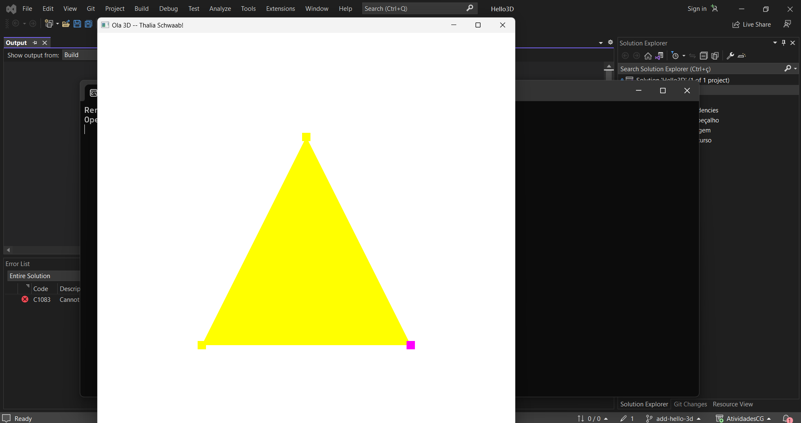
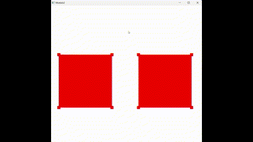
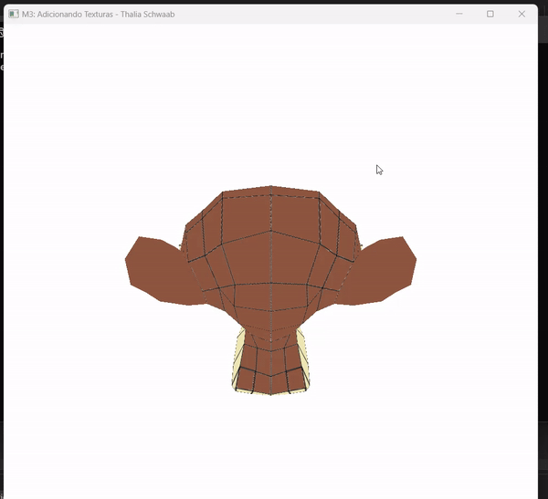
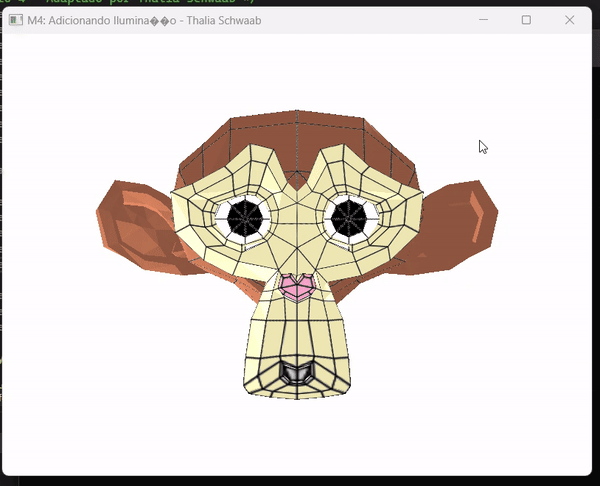
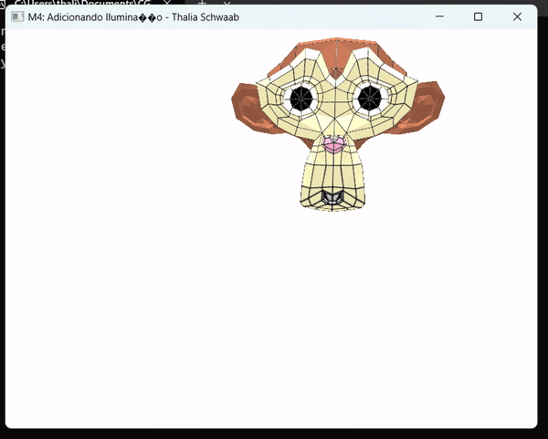

# Computação Gráfica

Repositório criado para a disciplina de Computação Gráfica.

# Módulo 1 - Criando o ambiente de Programação de cenas 3D
- Disponível na pasta [Hello3D](https://github.com/thaliaschwaab/AtividadesCG/tree/main/Hello3D)
- Código alterado para mostrar "Ola 3D -- Thalia Schwaab"

# Módulo 2 - Instanciando objetos na cena 3D
- Disponível na pasta [Modulo2](https://github.com/thaliaschwaab/AtividadesCG/tree/main/Modulo2)
- Transforma a pirâmide em um cubo
- Adiciona movimentos com A, W, S, D, I, J, [ e ]
- Adiciona mais um cubo

# Módulo 3 - Adicionando Texturas
- Disponível na pasta [Modulo3](https://github.com/thaliaschwaab/AtividadesCG/tree/main/Modulo3)
- Adiciona leitura de texturas

# Módulo 4 - Adicionando Iluminação
- Disponível na pasta [Modulo4](https://github.com/thaliaschwaab/AtividadesCG/tree/main/Modulo4)
- Adiciona iluminação

# Módulo 5 - Adicionando uma câmera em primeira pessoa
- Disponível na pasta [Modulo5](https://github.com/thaliaschwaab/AtividadesCG/tree/main/Modulo5)
- Adiciona movimentação de câmera através do mouse
- Mantém movimentação pelo teclado

