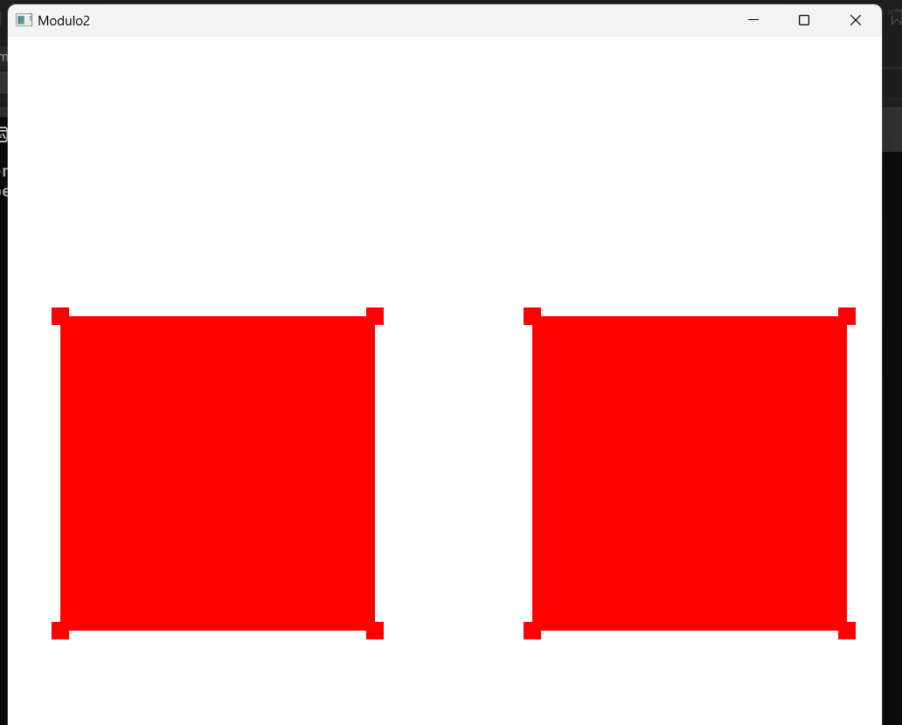
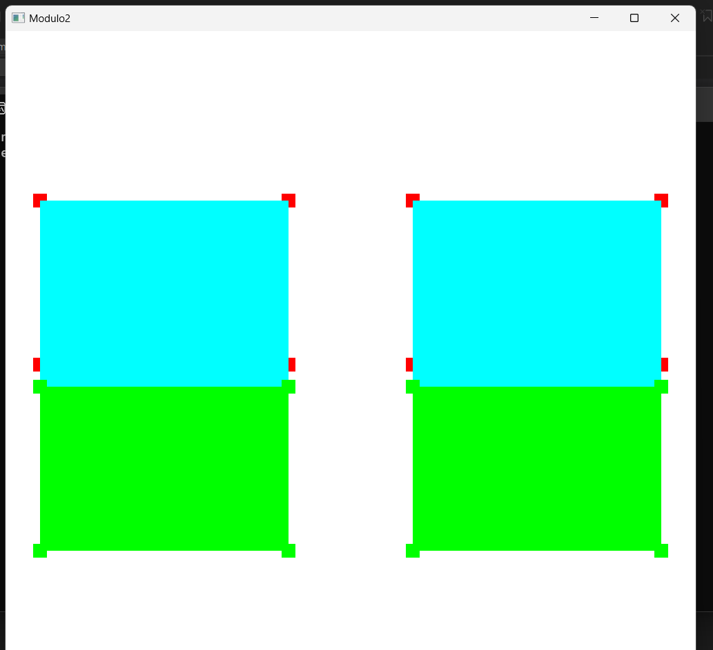

# Computação Gráfica

Repositório criado para a disciplina de Computação Gráfica.

# Módulo 1 - Criando o ambiente de Programação de cenas 3D
- Disponível na pasta [Hello3D](https://github.com/thaliaschwaab/AtividadesCG/tree/main/Hello3D)
- Código alterado para mostrar "Ola 3D -- Thalia Schwaab"

# Módulo 2 - Instanciando objetos na cena 3D
- Disponível na pasta [Modulo2](https://github.com/thaliaschwaab/AtividadesCG/tree/main/Modulo2)
- Transforma a pirâmide em um cubo
- Adiciona movimentos com A, W, S, D, I, J, [ e ]
- Adiciona mais um cubo

